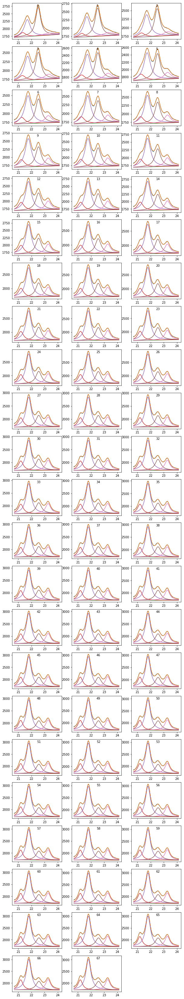
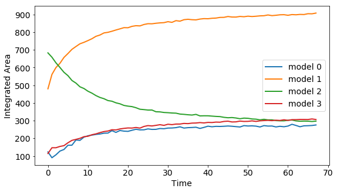

# curveFit.py

## Summary

Implements methods for fitting series of curves using a summation of arbitrary peak shapes and a background 
with the focus on use for time series.

Allows for:

  Fitting
  
  Integration
  
  Plotting
  
  
Integration and model parameters are returned as 2D numpy arrays to allow for facile manipulation of results as a time series.


## Example Usage of curveFit.py


```python
import pickle
import matplotlib

from curveFit import *

# for auto-reloading external modules
# see http://stackoverflow.com/questions/1907993/autoreload-of-modules-in-ipython
%load_ext autoreload
%autoreload 2
```

    The autoreload extension is already loaded. To reload it, use:
      %reload_ext autoreload
    


```python
with open('xjs622abc_2_processed.txt', 'rb') as handle:
  xdict = pickle.loads(handle.read())
with open('yjs622abc_2_processed.txt', 'rb') as handle:
  ydict = pickle.loads(handle.read())

xdata = xdict["4znco_2_02_rxn_1"][1:-1]
ydata = ydict["4znco_2_02_rxn_1"][1:-1]
```

### Fitting a model with 4 Lorrentz curves and a linear background


```python
rxn = fit([xdata, ydata], xl=256, xu=600)

#using 4 lorrentz models
rxn.addmodel(lorrentz, 3)
rxn.addmodel(lorrentz, 3)
rxn.addmodel(lorrentz, 3)
rxn.addmodel(lorrentz, 3)

#using a linear background
rxn.addbckg(linear, 2)
rxn.buildmodel()
rxn.fit([10., 21.1, .1] + [200., 21.7, .1] + [200., 22.5, .1] + [200., 23.2, .1], [2000, 0])

matplotlib.rcParams.update({'font.size': 10})
rxn.plot()
```

    fit 68 models
    





### Integrating and plottings results


```python
matplotlib.rcParams.update({'font.size': 14})
fig = plt.figure(figsize = (9,5))
areas = rxn.integrate()
lines = plt.plot(areas.T, linewidth = 2)
plt.ylabel("Integrated Area")
plt.xlabel("Time")
plt.legend(lines, ["model " + str(i) for i in range(areas.shape[0])])
plt.show()
```




